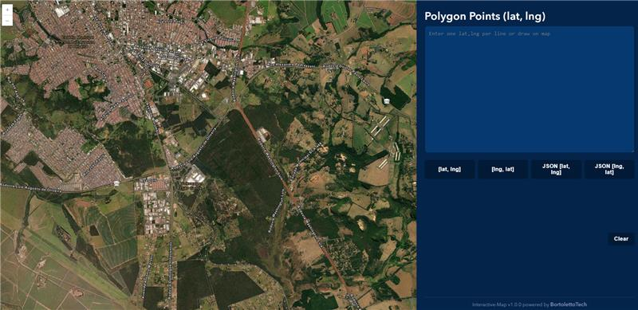
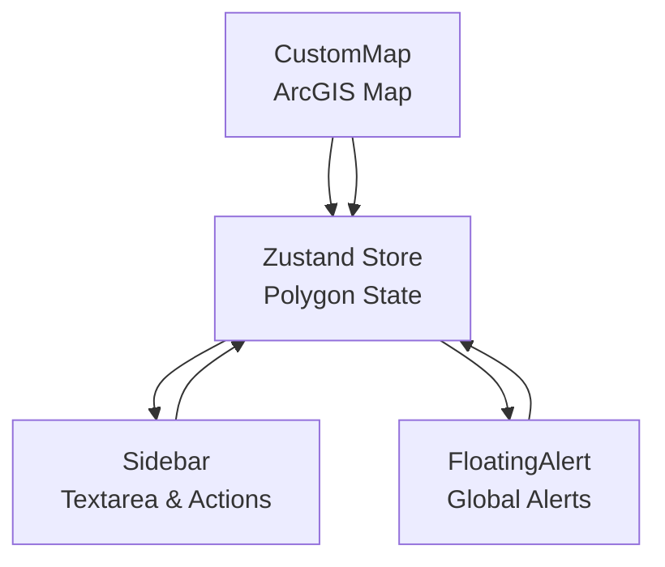

# Interactive Map

> A modern React app for drawing polygons on an ArcGIS map, with real-time coordinate editing and global state management



## 📋 Table of Contents

- [About the Project](#-about-the-project)
- [Features](#-features)
- [Technologies Used](#-technologies-used)
- [Architecture](#-architecture)
- [Prerequisites](#-prerequisites)
- [Installation and Setup](#-installation-and-setup)
- [Usage](#-usage)
- [Project Structure](#-project-structure)
- [Configuration](#-configuration)
- [Contributing](#-contributing)
- [License](#-license)

## 🎯 About the Project

**Interactive Map** is a React application that allows users to draw polygons on an ArcGIS map, edit coordinates in a sidebar textarea, and see real-time synchronization between the map and the form. The project was developed by BortolettoTech, demonstrating best practices with React, Zustand, and ArcGIS JS API.

### Why use this app?

- ✅ **ArcGIS Integration**: Draw polygons directly on a professional map
- ✅ **Real-time Sync**: Map and textarea stay in sync
- ✅ **Global State**: Robust state management with Zustand
- ✅ **User Feedback**: Floating alerts for user actions
- ✅ **Modern UI**: Sidebar, copy buttons, and dark theme

## 🚀 Features

- **Draw Polygons**: Add, remove, and clear points on the map
- **Textarea Sync**: Edit coordinates as text, instantly reflected on the map
- **Copy Formats**: Copy coordinates in multiple formats (array, JSON)
- **Floating Alerts**: User feedback for rapid actions or errors
- **Global Clear**: Remove all points with one click
- **Responsive Sidebar**: Modern, styled sidebar for controls

## 🛠 Technologies Used

- **React 18+** - Frontend framework
- **Vite** - Build tool
- **Zustand** - State management
- **ArcGIS JS API (@arcgis/core)** - Map rendering
- **TypeScript** - Type safety
- **CSS Modules** - Scoped styling

## 🏗 Architecture



### Data Flow

1. **User Action**: Add/remove points on map or textarea
2. **State Update**: Zustand store updates polygon points
3. **Sync**: Map and textarea update in real time
4. **Alert**: Floating alert shown for rapid or invalid actions

## 📋 Prerequisites

- **Node.js 18+** ([Download](https://nodejs.org/))
- **npm** (comes with Node.js)

## 🚀 Installation and Setup

1. **Clone the Repository**

```bash
git clone https://github.com/bortolettotech/interactive-map.git
cd interactive-map
```

2. **Install Dependencies**

```bash
npm install
```

3. **Run the Application**

```bash
npm run dev
```

4. **Open in Browser**

- App will be available at: `http://localhost:3000/`

## � Usage

- **Draw on Map**: Left-click to add points, right-click to remove last point, double-click to finish/clear
- **Edit in Sidebar**: Type or paste coordinates (lat, lng per line)
- **Copy Buttons**: Copy coordinates in various formats
- **Clear**: Remove all points
- **Alerts**: See floating alerts for rapid right-clicks or errors

## 📁 Project Structure

```
src/
├── components/
│   ├── Map/CustomMap.tsx         # ArcGIS map and event logic
│   ├── Sidebar/Sidebar.tsx       # Sidebar with textarea and actions
│   ├── FloatingAlert/FloatingAlert.tsx # Floating alert UI
│   └── Version/Version.tsx       # Version footer
├── hooks/
│   └── store.ts              # Zustand store for polygons and alerts
├── utils/
│   └── Map.ts                # ArcGIS map setup and event handlers
├── App.tsx                   # Main app layout
└── main.tsx                  # Entry point
```

## ⚙️ Configuration

- No special configuration required. ArcGIS JS API is loaded via npm package `@arcgis/core`.
- All state is managed client-side with Zustand.

## 🤝 Contributing

Contributions are welcome! To contribute:

1. Fork the project
2. Create a branch for your feature (`git checkout -b feature/new-feature`)
3. Commit your changes (`git commit -m 'Add new feature'`)
4. Push to the branch (`git push origin feature/new-feature`)
5. Open a Pull Request

### Development Standards

- Use TypeScript and React best practices
- Keep code modular and documented
- Ensure UI/UX consistency

## 📄 License

This project is under the MIT license. See the [LICENSE](LICENSE) file for more details.

---

<div align="center">
    <p>Developed with ❤️ by <strong>BortolettoTech</strong></p>
    <p>⭐ If this project was helpful, consider giving it a star!</p>
</div>
